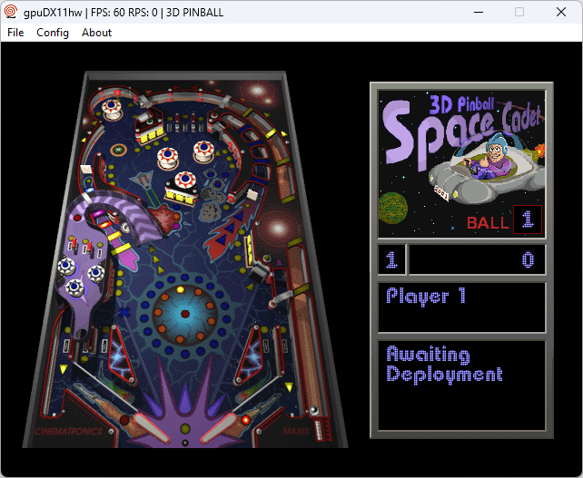

# 3D Pinball - Space Cadet for Dreamcast

Port of 3D Pinball - Space Cadet to the Sega Dreamcast, based on the [decompilation project](https://github.com/k4zmu2a/SpaceCadetPinball)

Built with [DreamSDK](https://github.com/dreamsdk/dreamsdk)

## Controls
* Paddles: DPad Left-Right / X/B / LT/RT
* Launch ball: DPad Down / A
* Nudge table: Y + DPad
* Pause: START
* New game: START + A
* GDemu reset: START + A + B + X + Y

## Known issues
* After playing for a short while, the score/mission info text panel starts displaying words in new lines, causing some text to not fully fit or be cut off
